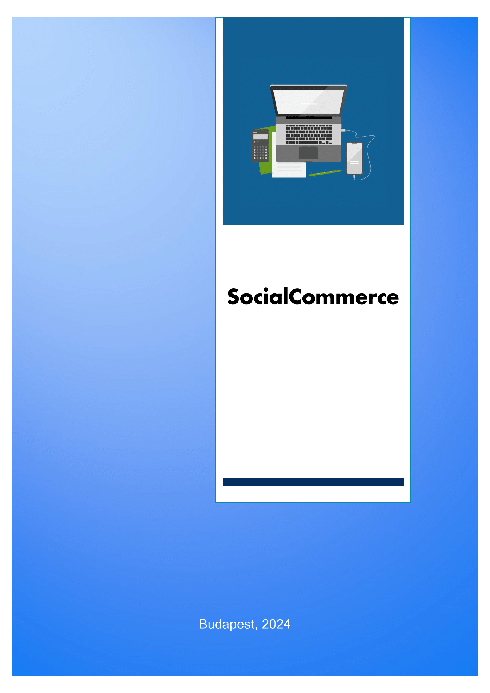
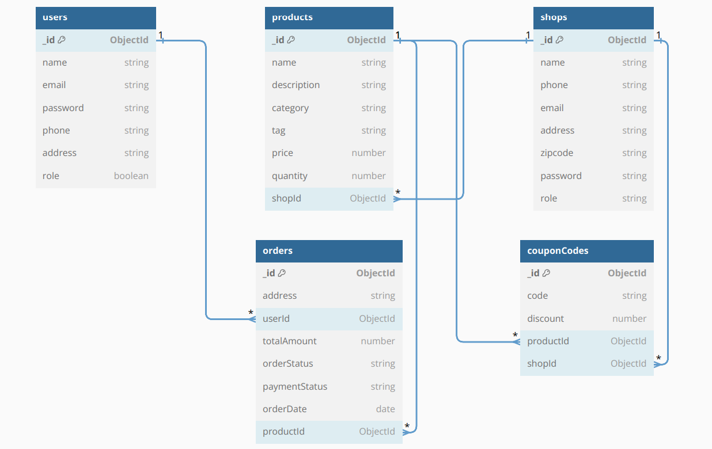

# A projektben résztvevők

- Hajdara Patrik – BackEnd
- Vinkovits János László – FrontEnd

# Konzulens

- Varga Zsófia - Webprogramozó

# Tartalomjegyzék

- [A webalkalmazás célja](#a-webalkalmás-célja)
- [Licencek](#licencek)
- [Felhasznált technológiák](#felhasznált-technológiák)
- [Követelmények](#követelmények)
  - [BackEnd](#backend)
    - [Funkcionális](#funkcionális)
      - [User](#user)
      - [Shop](#shop)
    - [Nem funkcionális](#nem-funkcionális)
- [Program leírása](#program-leírása)
- [Végpontok leírása](#végpontok-leírása)
  - [CouponCode](#couponcode)
  - [Order](#order)
  - [Product](#product)
  - [Shop](#shop)
  - [User](#user)
- [Controller-ek leírása](#controller-ek-leírása)
  - [CouponCode](#couponcode-1)
  - [Order](#order-1)
  - [Product](#product-1)
  - [Shop](#shop-1)
  - [User](#user-1)

# A webalkalmazás célja

A **Social Commerce** egy olyan közösségi platform, ahol bárki adhat el terméket, amit bárki megvásárolhat. Továbbá lehetőséget kínál az áruházak számára, melyek nem rendelkeznek webshoppal, hogy eladják termékeiket az online piacon gyorsan és egyszerűen.

# Licencek

A webalkalmazás zárt forráskódú, azonban felhasználható a megadott feltételek mellett.

# Felhasznált technológiák

## BackEnd keretrendszer:

- Express JS

## Adatbázis kiszolgáló:

- MongoDB

## E-mail küldés:

- NodeMailer

## FrontEnd keretrendszer:

- React JS

## CSS kiszolgáló:

- Tailwind CSS

## JavaScript kiszolgáló:

- Node JS

# Követelmények

## BackEnd

### Funkcionális:

#### User:

-	A vásárlás regisztrációhoz kötött
-	Regisztráció során kötelező megadni egy nevet, egy e-mailt és egy jelszót
-	A jelszónak legalább 8 karakterből kell állnia
-	Az első bejelentkezéshez kötelező a felhasználói fiók aktiválása a regisztráció után
-	Bejelentkezéshez kötelező megadni egy e-mailt és egy jelszót
-	A címek mentése (rendeléshez), értékelések írása (termékekhez) felhasználói fiókhoz kötött
-	Rendelés során kötelező megadni a szállítási adatokat, illetve a fizetési módot is
-	A termékek fiók létrehozása nélkül is megtekinthetőek

#### Shop:

-	Termékek eladásához eladói fiók regisztrálása szükséges
-	Regisztráció során kötelező megadni az eladó vagy a vállalkozás nevét, egy telefonszámot, egy e-mailt, az eladó vagy vállalkozás címét, egy irányítószámot és egy jelszót
-	A jelszónak legalább 8 karakterből kell állnia
-	Az első bejelentkezéshez kötelező az eladói fiók aktiválása a regisztráció után
-	Bejelentkezéshez kötelező megadni egy e-mailt és egy jelszót
-	Termék feltöltése során kötelező megadni a termék nevét, kategóriáját, leírását, árát, illetve képet a termékről

### Nem funkcionális:

-	Az adatbázis kiszolgáló a MongoDB (6.0)
-	Az e-maileket a NodeMailer (6.9.1) küldi
-	A projekt a NodeJS (16) használatával készült

# Tervek

## BackEnd terv

## FrontEnd terv

# Program leírása

## Végpontok leírása

### User:

-	Végpont neve: **/create-user**
-	Bejövő paraméter: -
-	Hova mutat: Fiók létrehozása

 

-	Végpont neve: **/activation**
-	Bejövő paraméter: activation token (string)
-	Hova mutat: Fiók aktiválása

 

-	Végpont neve: **/login-user**
-	Bejövő paraméter: email (string), password (string)
-	Hova mutat: Bejelentkezés

 

-	Végpont neve: **/update-user-info**
-	Bejövő paraméter: -
-	Hova mutat: Adatok frissítése

 

-	Végpont neve: **/update-user-password**
-	Bejövő paraméter: -
-	Hova mutat: Jelszó frissítése

 

-	Végpont neve: **/update-user-addresses**
-	Bejövő paraméter: -
-	Hova mutat: Címek hozzáadása, törlése

 

-	Végpont neve: **/admin-all-users**
-	Bejövő paraméter: -
-	Hova mutat: Összes felhasználó megtekintése

 

-	Végpont neve: **/delete-user**
-	Bejövő paraméter: -
-	Hova mutat: Felhasználó törlése

### Shop:

-	Végpont neve: **/create-shop**
-	Bejövő paraméter: -
-	Hova mutat: Fiók létrehozása

 

-	Végpont neve: **/activation**
-	Bejövő paraméter: activation token (string)
-	Hova mutat: Fiók aktiválása

 

-	Végpont neve: **/login-shop**
-	Bejövő paraméter: email (string), password (string)
-	Hova mutat: Bejelentkezés

 

-	Végpont neve: **/update-seller-info**
-	Bejövő paraméter: -
-	Hova mutat: Adatok frissítése

 

-	Végpont neve: **/admin-all-sellers**
-	Bejövő paraméter: -
-	Hova mutat: Összes eladó megtekintése (admin esetében)

 

-	Végpont neve: **/delete-seller**
-	Bejövő paraméter: -
-	Hova mutat: Eladó törlése

### Product:

-	Végpont neve: **/create-product**
-	Bejövő paraméter: shopId, images
-	Hova mutat: Termék létrehozása

-	Végpont neve: **/get-all-products-shop**
-	Bejövő paraméter: id
-	Hova mutat: Összes termék megtekintése (eladó esetében)

### Order:

-	Végpont neve: **/create-order**
-	Bejövő paraméter: cart, shippingAddress, user, totalPrice, paymentInfo
-	Hova mutat: Rendelés létrehozása

-	Végpont neve: **/get-all-orders**
-	Bejövő paraméter: userId
-	Hova mutat: Rendelések megtekintése (vásárló esetében)

-	Végpont neve: **/get-seller-all-orders**
-	Bejövő paraméter: shopId
-	Hova mutat: Rendelések megtekintése (eladó esetében)

-	Végpont neve: **/update-order-status**
-	Bejövő paraméter: -
-	Hova mutat: Rendelés státuszának frissítése

### CouponCode:

-	Végpont neve: **/create-cupon-code**
-	Bejövő paraméter: -
-	Hova mutat: Kupon létrehozása

-	Végpont neve: **/get-cupon**
-	Bejövő paraméter: id
-	Hova mutat: Összes kupon megtekintése (eladó esetében)

-	Végpont neve: **/delete-cupon**
-	Bejövő paraméter: -
-	Hova mutat: Kupon törlése

# Controller-ek leírása

## CouponCode:

- **create-coupon-code**
  - Metódus: POST
  - Működés: Ellenőrzi, hogy létezik-e már ilyen nevű kuponkód. Ha nem, létrehozza és visszaadja a létrehozott kuponkódot.
  - Visszatérési érték: Létrehozott kuponkód objektum

- **get-coupon**
  - Metódus: GET
  - Paraméterek: id (az eladó azonosítója)
  - Működés: Lekéri az adott eladóhoz tartozó összes kuponkódot.
  - Visszatérési érték: Eladóhoz tartozó kuponkódok listája

- **delete-coupon**
  - Metódus: DELETE
  - Paraméterek: id (kuponkód azonosítója)
  - Működés: Törli a megadott azonosítójú kuponkódot.
  - Visszatérési érték: Sikeres törlés üzenet

- **get-coupon-value**
  - Metódus: GET
  - Paraméterek: name (kuponkód neve)
  - Működés: Lekéri a megadott névvel rendelkező kuponkód értékét.
  - Visszatérési érték: Kuponkód objektum

## Order:

- **create-order**
  - Metódus: POST
  - Működés: A kosár tartalmát alapján létrehozza a rendeléseket, csoportosítva azokat eladók szerint.
  - Visszatérési érték: Létrehozott rendelések objektumok listája

- **get-all-orders/:userId**
  - Metódus: GET
  - Paraméterek: userId (a felhasználó azonosítója)
  - Működés: Lekéri az adott felhasználóhoz tartozó összes rendelést.
  - Visszatérési érték: Felhasználóhoz tartozó rendelések listája

- **get-seller-all-orders/:shopId**
  - Metódus: GET
  - Paraméterek: shopId (az eladó azonosítója)
  - Működés: Lekéri az adott eladóhoz tartozó összes rendelést.
  - Visszatérési érték: Eladóhoz tartozó rendelések listája

- **update-order-status/:id**
  - Metódus: PUT
  - Paraméterek: id (rendelés azonosítója)
  - Működés: Frissíti a megadott rendelés státuszát az eladó által megadott értékre.
  - Visszatérési érték: Frissített rendelés objektum

- **admin-all-orders**
  - Metódus: GET
  - Működés: Lekéri az összes rendelést az adatbázisból.
  - Visszatérési érték: Az összes rendelés listája

## Product:

- **create-product**
  - Metódus: POST
  - Működés: Létrehozza az új terméket az adott eladóhoz. Feltölti a termékhez kapcsolódó képeket.
  - Visszatérési érték: Létrehozott termék objektum

- **get-all-products-shop/:id**
  - Metódus: GET
  - Paraméterek: id (az eladó azonosítója)
  - Működés: Lekéri az adott eladóhoz tartozó üzletben található összes terméket.
  - Visszatérési érték: Eladóhoz tartozó termékek listája

- **delete-shop-product/:id**
  - Metódus: DELETE
  - Paraméterek: id (termék azonosítója)
  - Működés: Törli az adott azonosítójú terméket az adatbázisból.
  - Visszatérési érték: Sikeres törlés üzenet

- **get-all-products**
  - Metódus: GET
  - Működés: Lekéri az összes terméket az adatbázisból, rendezve a legfrissebbtől a legrégebbig.
  - Visszatérési érték: Az összes termék listája

- **create-new-review**
  - Metódus: PUT
  - Működés: Létrehoz vagy frissít egy értékelést egy adott termékhez, amihez egy felhasználó tartozik. Az értékelés átlagát is frissíti.
  - Visszatérési érték: Sikeres értékelés üzenet

- **admin-all-products**
  - Metódus: GET
  - Működés: Lekéri az összes terméket az adatbázisból, rendezve a legfrissebbtől a legrégebbig. Csak az admin jogosultsággal rendelkező felhasználók számára elérhető.
  - Visszatérési érték: Az összes termék listája

## Shop:

- **create-shop**
  - Metódus: POST
  - Működés: Létrehozza az új eladót a megadott adatok alapján. Küld egy aktivációs e-mailt a felhasználónak.
  - Visszatérési érték: Sikeres üzenet az aktivációs e-mail elküldéséről

- **activation**
  - Metódus: POST
  - Működés: Aktiválja az eladó fiókját az aktivációs link segítségével.
  - Visszatérési érték: Aktivált felhasználó objektum és token

- **login-shop**
  - Metódus: POST
  - Működés: Bejelentkezés az eladó fiókba az e-mail cím és jelszó alapján.
  - Visszatérési érték: Sikeres bejelentkezés üzenet és token

- **getSeller**
  - Metódus: GET
  - Működés: Lekéri az aktuális bejelentkezett eladó adatait.
  - Visszatérési érték: Az aktuális bejelentkezett eladó adatai

- **logout**
  - Metódus: GET
  - Működés: Kijelentkezteti az aktuális bejelentkezett eladót.
  - Visszatérési érték: Sikeres kijelentkezés üzenet

- **get-shop-info/:id**
  - Metódus: GET
  - Paraméterek: id (az eladó azonosítója)
  - Működés: Lekéri az adott azonosítójú eladó adatait.
  - Visszatérési érték: Az adott azonosítójú eladó adatai

- **update-shop-avatar**
  - Metódus: PUT
  - Működés: Frissíti az aktuális bejelentkezett eladó avatar képét.
  - Visszatérési érték: Frissített eladó objektum

- **update-seller-info**
  - Metódus: PUT
  - Működés: Frissíti az aktuális bejelentkezett eladó adatait.
  - Visszatérési érték: Frissített eladó objektum

- **admin-all-sellers**
  - Metódus: GET
  - Működés: Lekéri az összes eladót, csak az admin jogosultsággal rendelkező felhasználók számára elérhető.
  - Visszatérési érték: Az összes eladó listája

- **delete-seller/:id**
  - Metódus: DELETE
  - Paraméterek: id (az eladó azonosítója)
  - Működés: Törli az adott azonosítójú eladó profilját az adatbázisból.
  - Visszatérési érték: Sikeres törlés üzenet

## User:

- **create-user**
  - Metódus: POST
  - Működés: Létrehozza az új felhasználót a megadott adatok alapján. Aktivációs e-mailt küld a felhasználónak.
  - Visszatérési érték: Sikeres üzenet az aktivációs e-mail elküldéséről.

- **activation**
  - Metódus: POST
  - Működés: Aktiválja az felhasználó fiókját az aktivációs link segítségével.
  - Visszatérési érték: Aktivált felhasználó objektum és token.

- **login-user**
  - Metódus: POST
  - Működés: Bejelentkezés a felhasználó fiókjába az e-mail cím és jelszó alapján.
  - Visszatérési érték: Sikeres bejelentkezés üzenet és token.

- **getuser**
  - Metódus: GET
  - Működés: Lekéri az aktuális bejelentkezett felhasználó adatait.
  - Visszatérési érték: Az aktuális bejelentkezett felhasználó adatai.

- **logout**
  - Metódus: GET
  - Működés: Kijelentkezteti az aktuális bejelentkezett felhasználót.
  - Visszatérési érték: Sikeres kijelentkezés üzenet

- **update-user-info**
  - Metódus: PUT
  - Működés: Frissíti az aktuális bejelentkezett felhasználó adatait.
  - Visszatérési érték: Frissített felhasználó objektum.

- **update-avatar**
  - Metódus: PUT
  - Működés: Frissíti az aktuális bejelentkezett felhasználó avatar képét.
  - Visszatérési érték: Frissített felhasználó objektum.

- **update-user-addresses**
  - Metódus: PUT
  - Működés: Frissíti az aktuális bejelentkezett felhasználó címeit.
  - Visszatérési érték: Frissített felhasználó objektum.

- **delete-user-address/:id**
  - Metódus: DELETE
  - Paraméterek: id (a cím azonosítója)
  - Működés: Törli az adott azonosítójú felhasználó címét az adatbázisból.
  - Visszatérési érték: Sikeres törlés üzenet.

- **update-user-password**
  - Metódus: PUT
  - Működés: Frissíti az aktuális bejelentkezett felhasználó jelszavát.
  - Visszatérési érték: Sikeres üzenet a jelszó frissítéséről.

- **user-info/:id**
  - Metódus: GET
  - Paraméterek: id (a felhasználó azonosítója)
  - Működés: Lekéri az adott azonosítójú felhasználó adatait.
  - Visszatérési érték: Az adott azonosítójú felhasználó adatai.

- **admin-all-users**
  - Metódus: GET
  - Működés: Lekéri az összes felhasználót, csak az adminisztrátori jogosultsággal rendelkező felhasználók számára elérhető.
  - Visszatérési érték: Az összes felhasználó listája.

- **delete-user/:id**
  - Metódus: DELETE
  - Paraméterek: id (a felhasználó azonosítója)
  - Működés: Törli az adott azonosítójú felhasználó profilját az adatbázisból.
  - Visszatérési érték: Sikeres törlés üzenet.

