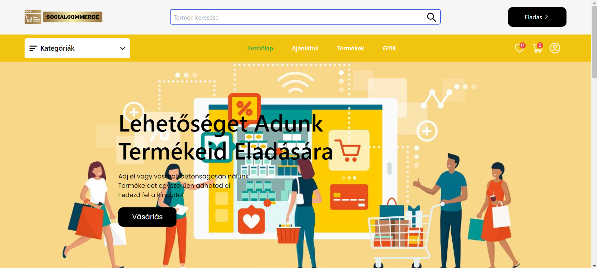

# Használati útmutató a **SocialCommerce** webalkalmazáshoz

## Tartalomjegyzék

- [SocialCommerce](#socialcommerce)
- [Az oldal elérhetősége](#az-oldal-elérhetősége)
- [Főoldal](#főoldal)

### SocialCommerce

A **SocialCommerce** egy olyan közösségi platform, ahol bátran eladhatod vagy megvásárolhatod a már elérhető termékeket. Továbbá lehetőséget kínálunk áruházad számára is, ha nem rendelkezel webshoppal, hogy eladhasd termékeidet az online piacon gyorsan és egyszerűen.

### Az oldal elérhetősége

Weboldalunk elérhető a www.socialcommerce.hu címen is.

### Főoldal

A főoldalon olvashatsz egy rövid leírást arról, hogy mi is az oldalunk lényege.
Böngészhetsz a kategóriák között, valamint megtekintheted az ajánlott vagy a felkapott termékeket.
Az oldal bal felső sarkában találod a webshop logóját, melyet választva mindig a főoldalra kerülsz (akár csak a Kezdőlap gomb esetében).
Ha kiválasztasz egy kategóriát, akkor az oldalon csak azok a termékek jelennek meg, amik az általad választott kategóriába tartoznak.
A menü sáv bal oldalán szintén megtalálod a kategóriaválasztót.
Középen találod a menüpontokat, melyekkel navigálhatsz az oldalon.
Jobb oldalon található a kívánságlista (szív ikon), ahová a kedvenc termékeidet mentheted el a későbbi vásárláshoz.
Mellette van a kosár, melybe a megvásárolni kívánt termékeket helyezheted el, módosíthatod a termék mennyiségét (ha több is elérhető belőle), illetve láthatod a várható végösszeget (a szállítási díjat minden esetben az eladó határozza meg).
A kosár ikonja mellett helyezkedik el a profil ikon, melyet választva bejelentkezhetsz vásárlói fiókodba, vagy regisztrálhatsz, ha még nem rendelkezel fiókkal.
